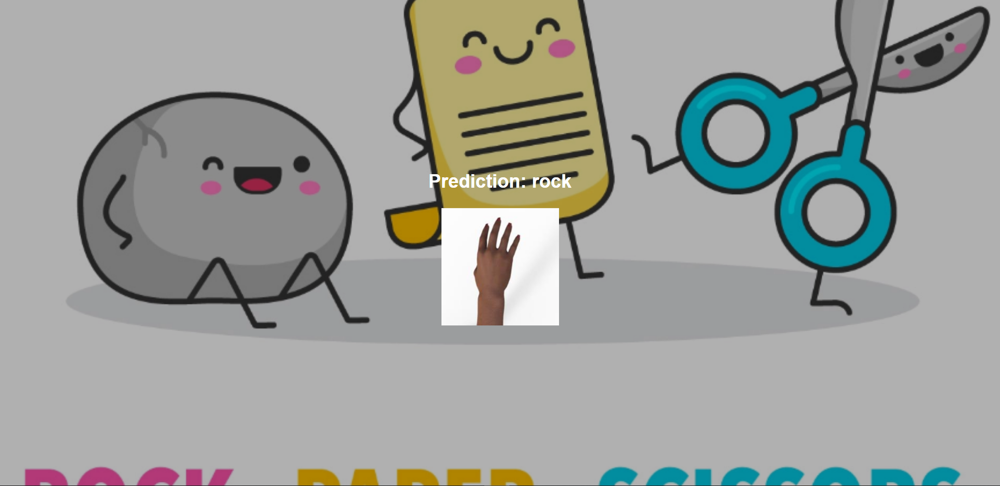

# Intro to Flask with Tensorflow Lite

- In this assignment, you will use the tflite file you created in the TF Lite assignment and use Flask to build a simple
app that predicts what the input image is

- The frontend should look as below if you deploy the app correctly:

- And if you wrote the inference function right and render the result template correctly, the output should look as below:

- _Make sure you use an image from the test_images folder to test your app_.
