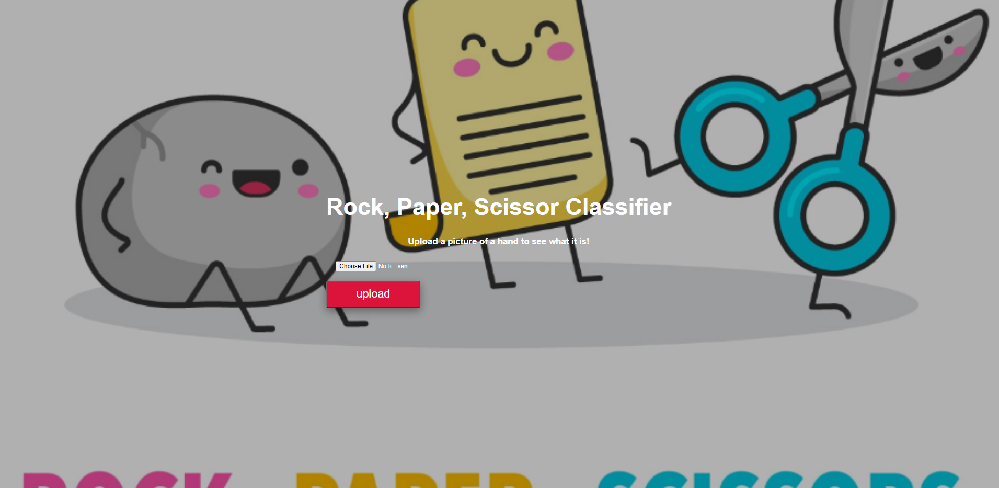
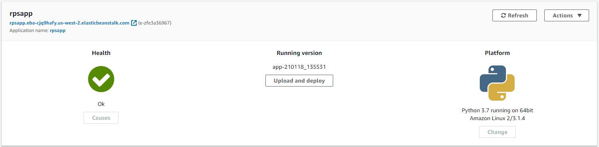

# Deploy Flask app with Tensorflow Lite in AWS Elastic BeanStalk

- In this assignment, you will use the tflite file you created in the TF Lite assignment and use Flask to build a simple
app that predicts what the input image is

- The frontend should look as below if you deploy the app correctly:



- And if you wrote the inference function right and render the result template correctly, the output should look as below:


- _Make sure you use an image from the test_images folder to test your app_.

## Deploying the App in AWS BeanStalk

In this assignment you will modify the Rock Paper Scissor App so that you can deploy it using Aws Elastic Beanstalk (EBS).

To do this, follow the following steps:

__Step 1:__

- Start with creating a `.ebignore` file and add `__pycache__` since Elastic Beanstalk won't use `.gitignore`.

__Step 2:__

- Create a `requirements.txt` file where you save the python packages your application needs with the versions. In this
example we use the following:

```
matplotlib
tensorflow
Flask==1.1.2
```

__Step 4:__

- The static and templates folder stays the same.
- We add a `__init__.py` file where we create the Flask app and we use `app.app_context()` to import the `routes.py` file.
- The `routes.py` will specify the `rock_paper_scissor` function.
- We also need to create a favicon since EBS expects is and for this assignment, I have provided it for you.

__Step 5:__

- AWS EBS requires you to have a specific folder structure.

```
rpsapp
    - .elasticbeanstalk
    - rpsapp
        - static
        - templates
        - __init__.py
        - favicon.py
        - inference.py
        - routes.py
    - .ebignore
    - application.py
    - requirements.txt
.gitignore
README
```

__Step 6:__

- The `.elasticbeanstalk` folder with config is created when you call:
```
eb init -p python-3.7 rpsapp --region us-west-2
```

- Where the `-p` stands for `platform` and you can look at [Python platform history](https://docs.aws.amazon.com/elasticbeanstalk/latest/platforms/platform-history-python.html) to see the python distributions available for you. Currently the only two are Python 3.7 and Python 3.6. You can bypass
this if you use docker to package your application, but in this exercise we will use the default platform options that's
available.

- The `region` specifies the region where you want to create the instance and in our case we will use `us-west-2`.

__Step 7:__

- Next to create the AWS EBS instance:

```
eb create rpsapp --instance_type t2.large
```

- Where we can use the `instance_type` flag to specify the instance we want.

__Step 8:__

- Finally, if you deploy the application currectly, you will get a success message from the logs and when you visit the
AWS EBS GUI, you will be able to see the following screen.



- The health should be ok and you can see the platform in which your app is running.

__Step 9:__

- You can verify and test your app by either running:

```
eb open
```

- Or, by using the link that you can see below your name in the `rpsapp` in the image above.

__Step 10:__

- Finally, make sure you terminate your instance and to do that, you can run:

```
eb terminate rpsapp
```

- Which will terminate the application and release all the resources.

### Reference

- [Using the Elastic Beanstalk command line interface (EB CLI)](https://docs.aws.amazon.com/elasticbeanstalk/latest/dg/eb-cli3.html)

- [AWS Elastic Beanstalk](https://docs.aws.amazon.com/elasticbeanstalk/latest/dg/Welcome.html)
